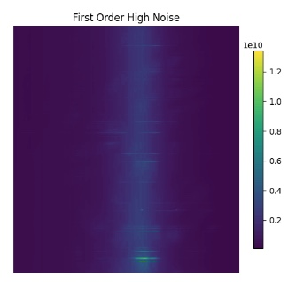

# ROAD_anomaly_detection
## Table of Contents
- [Installation](#installation)
- [Requirements](#requirements)
- [Usage](#usage)
- [Report](#report)

## Requirements

- ```Python >=3.12.6```

## Installation


1. Clone the respository:
```bash
git clone https://github.com/brip1258/Spectrogram_Anomaly_Detection.git
```
2. Navigate to the project directory: 
```bash
cd Spectrogram_Anomaly_Detection
```
3. Create and activate a virtual environment (Optional but recommended):
```bash
python3 -m venv env
source env/bin/activate
```
4. Install the required dependencies:
```bash
pip install -r requirements.txt
```
## Usage
To run the script, use the below command:
```bash
python main.py 
```

## Report
### Data Exploration:
For my exploratory data analysis (EDA) of the ROAD_dataset.h5 file, I began by examining its structure. I created functions to evaluate each group and its contents. The dataset contains 10 anomaly groupings with imbalanced sample sizes, ranging from 56 samples for Oscillating Tiles to 550 samples for the Galactic Plane. Additionally, there are observations categorized as "Normal", but has a description of "All Non-Characterized Effects". Based on these definitions, it appears that the data includes "Normal" observation, however, it had potential anomalies that existed within the broader dataset that have not been explicitly characterized. Overall, this opens the door to a supervised learning approach, which will be considered in subsequent analysis.
    
I explored the data characteristics using pair plots to visualize relationships between features. To identify patterns, I plotted all observations together as well as a single row of observation within each grouping to examine group-level trends. Additionally, I analyzed individual rows to compare specific observations. While I considered creating additional features, my understanding of the dataset indicates that the raw data was already reduced in dimensionality during its creation through auto-correlation. Given this preprocessing step, further aggregation could risk misrepresenting the data and obscuring meaningful patterns. 

I also evaluated other characteristics, such as minimum, maximum, average, and standard deviation, to understand the distribution of the groupings within the dataset. I confirmed that there were no null values in the data. To further identify patterns, I created heatmaps for each grouping. The first set of heatmaps visualizes the spectrogram data from a single i-th indexed observation, highlighting key features such as intensity noise patterns and repetitive frequency patterns. For instance, First Order Noise and Solar Flares have heatmaps that look similar, which could potentially lead to misclassifications. Additionally, I analyzed heatmaps of frequency bands, which provide a good representation of the magnitude of frequency. Similar to the spectrogram heatmaps, these can reveal differences and similarities among the grouped data based on their frequency band characteristics.

It is evident that multiple classes can represent a single observation, leading to overlap in the data. This observation indicates the possibility of conducting multi-label classification. However, for the purposes of sampling, we will focus only on labels with a single classification to ensure confident identification of anomalies. Another finding was that the training data contains two labels: an empty string and a string of "1." Although I could not find a direct definition of these labels, it is apparent from the EDA that the empty string values differ significantly in their graphical representation from the anomalous occurrences. Therefore, these empty string values will be considered "normal."

<p align="center">
  
  
</p>

### Model
Before modeling, I preprocessed the training data. While the dataset included multi-labeled observations, most observations had single classifications, either as one of nine anomalies (Oscillating Tile, First Order High Noise, First Order Data Loss, Third Order Data Loss, Lightning, RFI Ionosphere Reflect, Galactic Plane, Source in Sidelobes, or Solar Storm) or as Normal. For training, I focused on a subset of observations with single classifications. Normal data was identified as observations in the training set with no labels. To address the class imbalance, I aimed for as close to equal representation of each category as possible to minimize bias in the training data. The model was trained on a total sample of 455 observations, with each category representing 10% of the sample. The input features for the model were the spectrogram data, represented in 4 dimensions: time, frequency, polarization, and station. The output was the classification of each observation as Normal or one of the defined anomalies. 

I initially used a Random Forest model as a baseline to identify areas for improvement. Based on the results, I decided to implement a Convolutional Neural Network (CNN). A CNN was chosen because it is well-suited for multidimensional datasets like this one. CNNs are highly effective at extracting meaningful features from complex data structures The exploratory data analysis (EDA) highlighted significant noise in the dataset. CNNs are great in isolating important features while filtering out irrelevant noise, making them an ideal choice for achieving more accurate predictions.

CNN Results:
- Accuracy of 63%
- Precision of 71%
- Recall of 63% 


Random Forest Results:
- Accuracy of 59%
- Precision of 66%
- Recall of 59%

These results are promising, but the increase in scores suggest the or model choice is on the right track. Though there may not have been a large increase in the performance, the reasoning could be based on the limited sample size that was used. In order to address this I could increase the sample size, which is conditional due to the imbalance int he original data set.

For future improvements we can take steps by obtaining more data or I could create augments/synthetic data. I could also, modify the model architecture, utilize different epoch values, or adjust different hyper parameters. Another aspect would to be to introduce another feature that was represented in the data, band frequency. I could also simplify the problem if allowed to a binary classification system of normal and not normal, the performance could be significantly better and you may be able to utilize a lighter weight model. 

For me to determine if this is a 'good' model or not, would be dependent on the context of which we are applying this model. Though my development is a good start there is a significant number of avenues that can be taken to evaluate this data set, develop the model, and implement it to scale. 